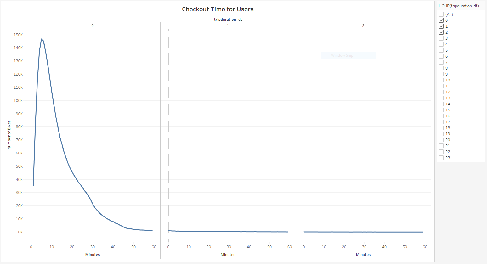
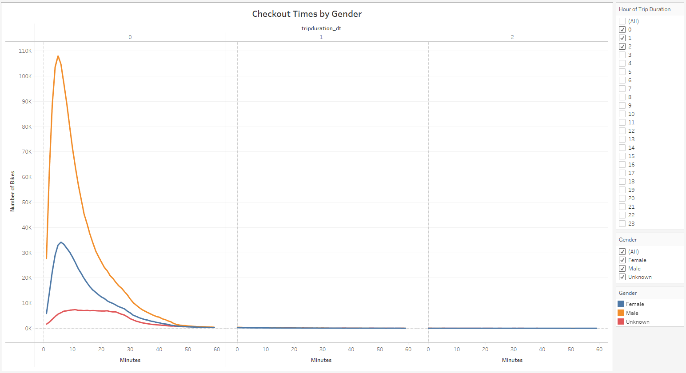
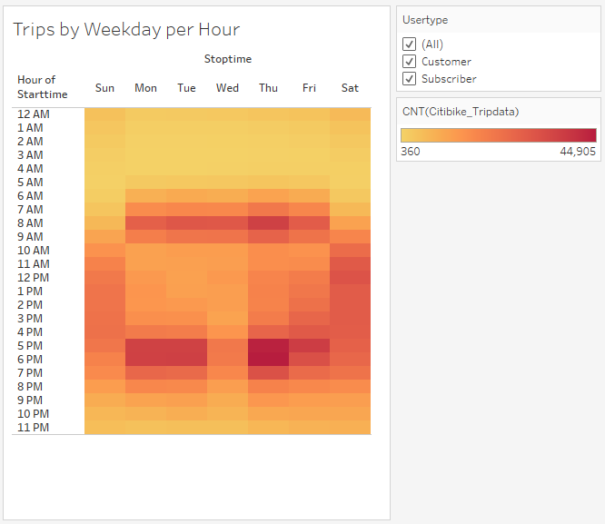
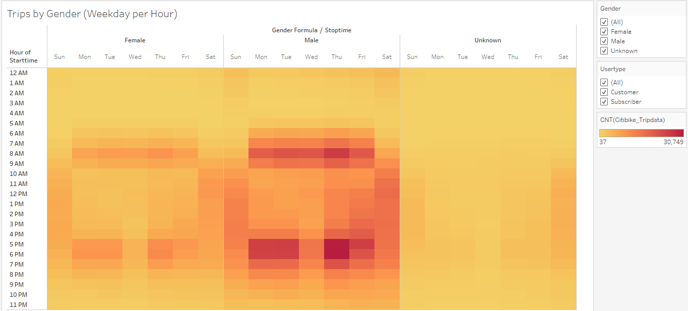
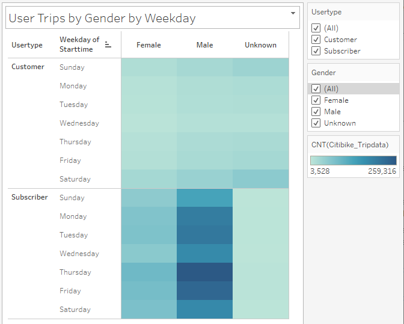
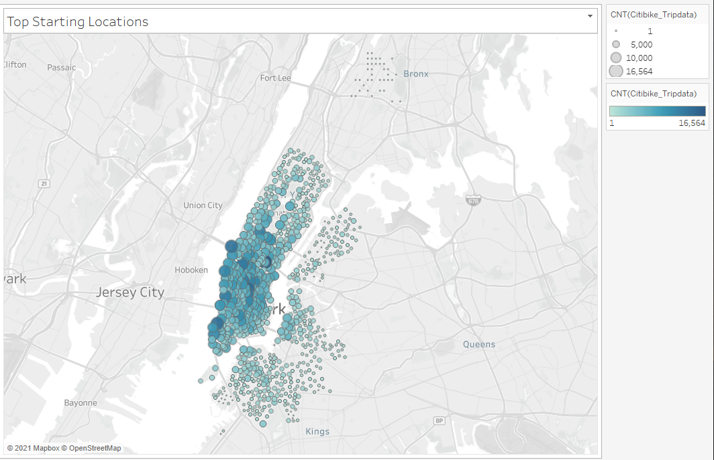
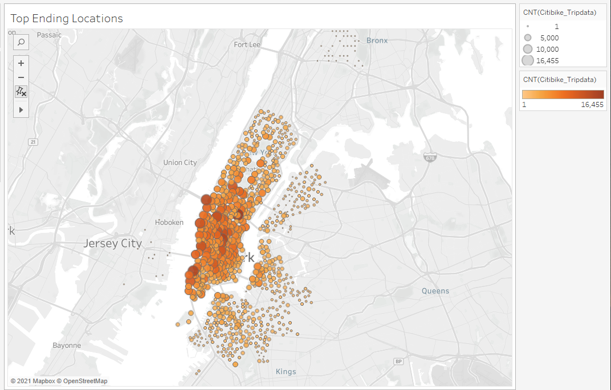
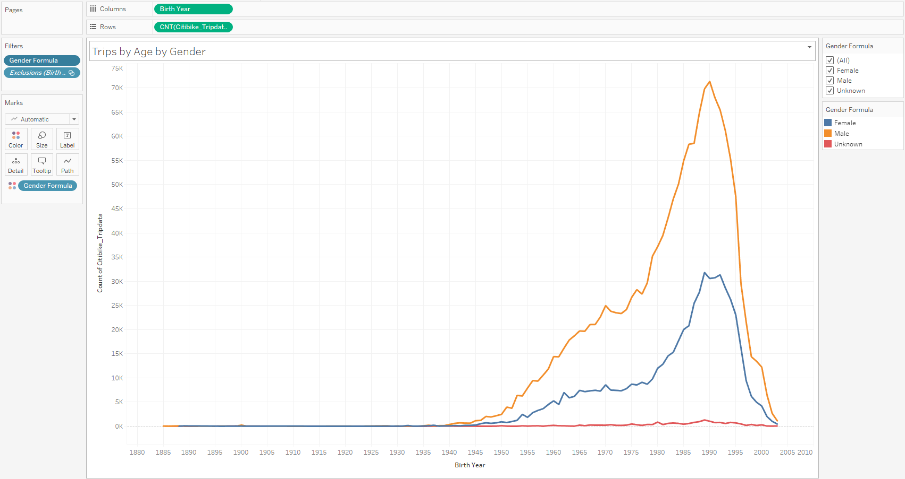
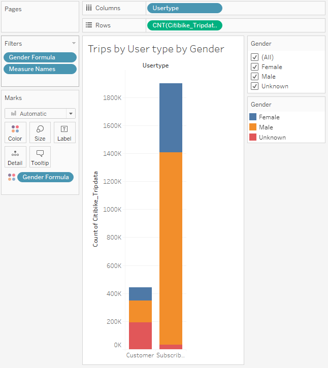

# bikesharing

## Project Overview

Analyzing Citi Bike data for August 2019 to be used in the business propopsal for the potential bike sharing program in Des Moines, Iowa. This analysis will be providing details on the following:

- How long bikes are checked out for all riders and genders.
- How many trips are taken by the hour for each day of the week, for all riders and genders.
- A breakdown of what days of the week a user might be more likely to check out a bike, by type of user and gender.
- Geographical insight on the top starting & top ending locations.

The Tableau story can be viewed [here](https://public.tableau.com/profile/josh.bissessar#!/vizhome/NYCCitibike_16171447740660/Aug2019TripAnalysis)

## Resources

Data Source: [August 2019 Citi Bike Trip Histories](https://s3.amazonaws.com/tripdata/index.html)
Software: Tableau Public 2021.1.0, Jupyter Notebook 6.1.4

## Results

#### 1. Checkout Times for Users

  

- Majority of users checkout bikes for a duration under 20 minutes.

#### 2. Checkout Times by Gender

  

- Majority of the users that checkout bikes for under 20 minutes are male.

#### 3. Trips By Weekday per Hour

  

- Majority of bike trips are taken between 7:00 a.m. - 9:00 a.m. and 4:00 p.m. - 6:00 p.m.

#### 4. Trips by Gender by Weekday per Hour

  

- Majority of Citi Bike users during weekdays between the hours of 7:00 a.m. - 9:00 a.m. and 4:00 p.m. - 6:00 p.m. are male.

#### 5. User Trips by Gender by Weekday

  

- Majority of subscribers are male, with a larger number of trips occuring on Monday, Tuesday, Thurday and Friday.

#### 6. Top Starting Locations

  

#### 7. Top Ending Locations

  

- There is a larger number trips starting and ending in the Lower Manhattan area.

## Summary

Recommendations for other visualizations for potential investors:

1. Trips by Age by Gender

  

2. Trips by Usertype by Gender

  

